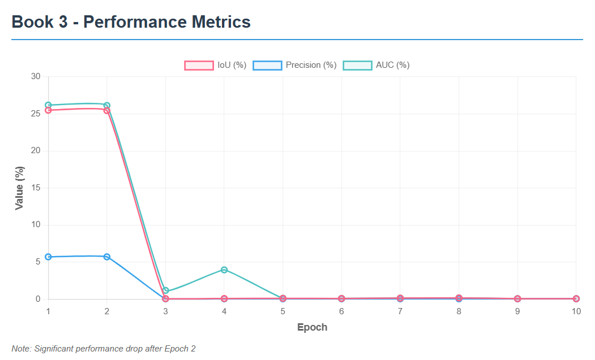

# Assignment 4 -- SeqTrack Inference Evaluation

## About the Report

This report presents the final phase of the SeqTrack project, focusing on inference and evaluation. The trained model from Assignment 3 was used to perform full-sequence inference on the LaSOT dataset to measure tracking performance and efficiency across multiple epochs. This document includes placeholders for each sequence's results, graphs, and reflections to be filled after evaluation.

## 1. Introduction

This section introduces the continuation of the SeqTrack project from Assignment 3. It describes the transition from model training to inference and evaluation. The goal is to analyze how the model performs on unseen test data using various evaluation metrics.

## 2. Methodology

Describe the inference and evaluation process here, including how checkpoints were selected, which dataset subset was used, and what scripts or configurations were applied.

## Sequence: Book 3

### Table 1: Inference Rate Results

| **Epoch** | **FPS** |
|-----------|---------|
| 1 | 16.53 |
| 2 | 16.11 |
| 3 | 18.48 |
| 4 | 18.39 |
| 5 | 17.39 |
| 6 | 28.88 |
| 7 | 25.27 |
| 8 | 28.01 |
| 9 | 19.20 |
| 10 | 24.13 |

### Table 2: Evaluation Metrics

| **Epoch** | **IoU** | **Precision** | **AUC** |
|-----------|---------|---------------|---------|
| 1 | 0.2550 | 5.72 | 26.19 |
| 2 | 0.2545 | 5.72 | 26.14 |
| 3 | 0.0008 | 0.06 | 1.19 |
| 4 | 0.0010 | 0.06 | 3.96 |
| 5 | 0.0012 | 0.06 | 0.13 |
| 6 | 0.0010 | 0.06 | 0.11 |
| 7 | 0.0015 | 0.06 | 0.15 |
| 8 | 0.0018 | 0.06 | 0.18 |
| 9 | 0.0007 | 0.06 | 0.08 |
| 10 | 0.0007 | 0.06 | 0.08 |

### Graph 1: IoU / Precision / AUC vs Epoch

<!-- Or in Word: Insert → Pictures → select your Book 3 screenshot -->

## Sequence: Book 10

### Table 1: Inference Rate Results

| **Epoch** | **FPS** |
|-----------|---------|
| 1 | 16.65 |
| 2 | 16.62 |
| 3 | 16.48 |
| 4 | 18.32 |
| 5 | 18.03 |
| 6 | 29.87 |
| 7 | 28.76 |
| 8 | 24.63 |
| 9 | 27.76 |
| 10 | 20.66 |

### Table 2: Evaluation Metrics

| **Epoch** | **IoU** | **Precision** | **AUC** |
|-----------|---------|---------------|---------|
| 1 | 0.7173 | 0.06 | 69.78 |
| 2 | 0.7173 | 0.06 | 69.78 |
| 3 | 0.7173 | 0.06 | 69.78 |
| 4 | 0.0012 | 0.06 | 4.85 |
| 5 | 0.0017 | 0.06 | 0.39 |
| 6 | 0.0021 | 0.06 | 0.21 |
| 7 | 0.0021 | 0.06 | 0.21 |
| 8 | 0.0020 | 0.06 | 0.26 |
| 9 | 0.0020 | 0.06 | 0.41 |
| 10 | 0.0020 | 0.06 | 0.20 |

### Graph 1: IoU / Precision / AUC vs Epoch

## Sequence: Book 11

### Table 1: Inference Rate Results

| **Epoch** | **FPS** |
|-----------|---------|
| 1 | 16.61 |
| 2 | 16.39 |
| 3 | 18.38 |
| 4 | 18.19 |
| 5 | 18.28 |
| 6 | 16.13 |
| 7 | 21.18 |
| 8 | 30.91 |
| 9 | 27.17 |
| 10 | 29.63 |

### Table 2: Evaluation Metrics

| **Epoch** | **IoU** | **Precision** | **AUC** |
|-----------|---------|---------------|---------|
| 1 | 0.0200 | 0.05 | 4.83 |
| 2 | 0.0198 | 0.05 | 4.80 |
| 3 | 0.0007 | 0.29 | 0.13 |
| 4 | 0.0007 | 0.05 | 0.12 |
| 5 | 0.0010 | 0.34 | 0.15 |
| 6 | 0.0016 | 0.05 | 0.16 |
| 7 | 0.0016 | 0.05 | 0.16 |
| 8 | 0.0015 | 0.05 | 0.16 |
| 9 | 0.0015 | 0.05 | 0.16 |
| 10 | 0.0015 | 0.05 | 0.15 |

### Graph 1: IoU / Precision / AUC vs Epoch

## Sequence: Book 19

### Table 1: Inference Rate Results

| **Epoch** | **FPS** |
|-----------|---------|
| 1 | 16.52 |
| 2 | 16.54 |
| 3 | 18.48 |
| 4 | 18.58 |
| 5 | 18.61 |
| 6 | 21.33 |
| 7 | 30.23 |
| 8 | 27.95 |
| 9 | 30.57 |
| 10 | 28.37 |

### Table 2: Evaluation Metrics

| **Epoch** | **IoU** | **Precision** | **AUC** |
|-----------|---------|---------------|---------|
| 1 | 0.2908 | 11.87 | 30.36 |
| 2 | 0.2908 | 11.87 | 30.35 |
| 3 | 0.0006 | 0.03 | 2.26 |
| 4 | 0.0006 | 0.03 | 2.04 |
| 5 | 0.0008 | 0.03 | 0.09 |
| 6 | 0.0011 | 0.03 | 0.11 |
| 7 | 0.0011 | 0.03 | 0.11 |
| 8 | 0.0011 | 0.03 | 0.11 |
| 9 | 0.0011 | 0.03 | 0.11 |
| 10 | 0.0010 | 0.03 | 0.10 |

### Graph 1: IoU / Precision / AUC vs Epoch

## Sequence: Coin 3

### Table 1: Inference Rate Results

| **Epoch** | **FPS** |
|-----------|---------|
| 1 | 16.51 |
| 2 | 16.17 |
| 3 | 18.43 |
| 4 | 18.23 |
| 5 | 18.46 |
| 6 | 30.30 |
| 7 | 30.24 |
| 8 | 29.80 |
| 9 | 30.97 |
| 10 | 27.30 |

### Table 2: Evaluation Metrics

| **Epoch** | **IoU** | **Precision** | **AUC** |
|-----------|---------|---------------|---------|
| 1 | 0.0150 | 0.10 | 4.65 |
| 2 | 0.0147 | 0.10 | 4.59 |
| 3 | 0.0065 | 18.63 | 3.54 |
| 4 | 0.0014 | 0.10 | 0.15 |
| 5 | 0.0038 | 0.20 | 1.41 |
| 6 | 0.0037 | 0.20 | 0.37 |
| 7 | 0.0029 | 0.20 | 0.30 |
| 8 | 0.0029 | 0.20 | 0.30 |
| 9 | 0.0028 | 0.20 | 0.30 |
| 10 | 0.0028 | 0.20 | 0.28 |

### Graph 1: IoU / Precision / AUC vs Epoch

[Insert Graph Image or Plot Here for Sequence: Coin 3]

## Sequence: Coin 6

### Table 1: Inference Rate Results

| **Epoch** | **FPS** |
|-----------|---------|
| 1 | 29.19 |
| 2 | 27.68 |
| 3 | 24.81 |
| 4 | 27.11 |
| 5 | 26.60 |
| 6 | 27.50 |
| 7 | 29.00 |
| 8 | 27.82 |
| 9 | 29.23 |
| 10 | 22.60 |

### Table 2: Evaluation Metrics

| **Epoch** | **IoU** | **Precision** | **AUC** |
|-----------|---------|---------------|---------|
| 1 | 0.0723 | 20.87 | 9.66 |
| 2 | 0.0723 | 20.87 | 9.66 |
| 3 | 0.0723 | 20.87 | 9.66 |
| 4 | 0.0723 | 20.87 | 9.66 |
| 5 | 0.0723 | 20.87 | 9.66 |
| 6 | 0.0006 | 0.03 | 0.06 |
| 7 | 0.0011 | 0.10 | 0.11 |
| 8 | 0.0009 | 0.06 | 0.09 |
| 9 | 0.0009 | 0.06 | 0.09 |
| 10 | 0.0011 | 0.10 | 0.11 |

### Graph 1: IoU / Precision / AUC vs Epoch

[Insert Graph Image or Plot Here for Sequence: Coin 6]

## Sequence: Coin 7

### Table 1: Inference Rate Results

| **Epoch** | **FPS** |
|-----------|---------|
| 1 | 16.45 |
| 2 | 18.08 |
| 3 | 17.97 |
| 4 | 18.25 |
| 5 | 18.47 |
| 6 | 31.55 |
| 7 | 28.20 |
| 8 | 29.07 |
| 9 | 30.89 |
| 10 | 30.03 |

### Table 2: Evaluation Metrics

| **Epoch** | **IoU** | **Precision** | **AUC** |
|-----------|---------|---------------|---------|
| 1 | 0.0290 | 0.36 | 4.83 |
| 2 | 0.0009 | 0.06 | 0.12 |
| 3 | 0.0026 | 0.06 | 2.25 |
| 4 | 0.0009 | 0.06 | 0.16 |
| 5 | 0.0015 | 0.12 | 0.22 |
| 6 | 0.0015 | 0.06 | 0.16 |
| 7 | 0.0023 | 0.12 | 0.24 |
| 8 | 0.0026 | 0.12 | 0.26 |
| 9 | 0.0016 | 0.06 | 0.16 |
| 10 | 0.0019 | 0.12 | 0.19 |

### Graph 1: IoU / Precision / AUC vs Epoch

[Insert Graph Image or Plot Here for Sequence: Coin 7]

## Sequence: Coin 18

### Table 1: Inference Rate Results

| **Epoch** | **FPS** |
|-----------|---------|
| 1 | 25.06 |
| 2 | 25.14 |
| 3 | 24.60 |
| 4 | 22.44 |
| 5 | 23.87 |
| 6 | 23.44 |
| 7 | 29.62 |
| 8 | 22.57 |
| 9 | 22.43 |
| 10 | 30.70 |

### Table 2: Evaluation Metrics

| **Epoch** | **IoU** | **Precision** | **AUC** |
|-----------|---------|---------------|---------|
| 1 | 0.0293 | 0.09 | 4.92 |
| 2 | 0.0293 | 0.09 | 4.92 |
| 3 | 0.0293 | 0.09 | 4.92 |
| 4 | 0.0293 | 0.09 | 4.92 |
| 5 | 0.0293 | 0.09 | 4.92 |
| 6 | 0.0017 | 0.09 | 0.19 |
| 7 | 0.0038 | 0.18 | 0.39 |
| 8 | 0.0017 | 0.09 | 0.17 |
| 9 | 0.0017 | 0.09 | 0.17 |
| 10 | 0.0017 | 0.09 | 0.18 |

### Graph 1: IoU / Precision / AUC vs Epoch

[Insert Graph Image or Plot Here for Sequence: Coin 18]

## Reflections

Each team member should write a short reflection about what they learned from the inference and evaluation phase. Discuss challenges, insights, and understanding gained about SeqTrack performance.

## GitHub Repository

[Insert your GitHub Repository Link Here]

## Conclusion

Conclude with a brief summary of what was achieved in Assignment 4. Emphasize the connection between training (Assignment 3) and inference (Assignment 4), and how evaluation validated model performance.